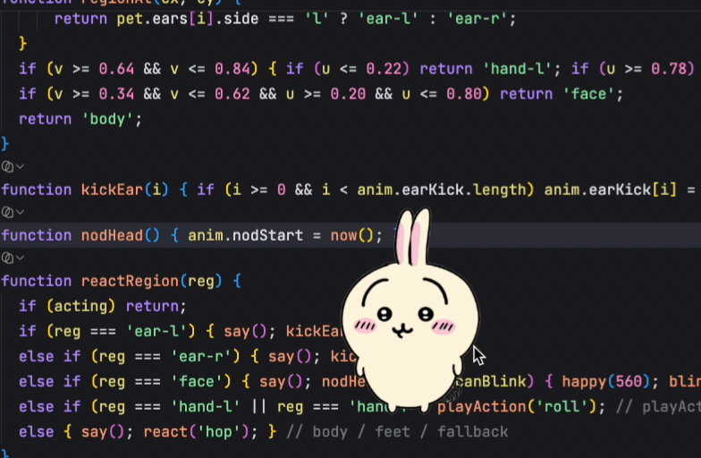
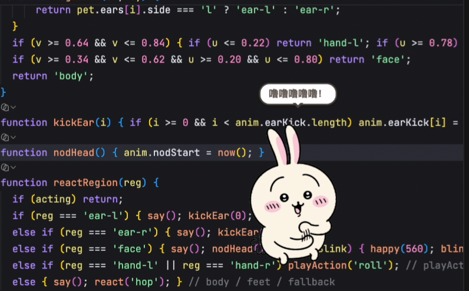

# OhMyChiikawa

**言語:** [简体中文](README.md) | [English](README.en.md) | [日本語](README.ja.md)

OhMyChiikawa は macOS と Windows 向けの軽量デスクトップペットです。起動すると、既定のキャラクター **うさぎ** がデスクトップに表示されます。右クリックメニューから **ちいかわ**、**ハチワレ**、**モモンガ** にいつでも切り替えられます。4 つのキャラクターはドラッグ移動、部位ごとのクリック反応、カーソル追従、ときどき散歩、待機中のまばたきや耳の小さな揺れに対応しています。

## プレビュー

| デスクトップ表示 | インタラクション |
| --- | --- |
|  |  |

## 機能

- 複数キャラクター：**うさぎ**、**ちいかわ**、**ハチワレ**、**モモンガ** を同梱。右クリックメニューからいつでも切り替えられ、最後に選んだキャラクターを記憶します。
- 3 言語切り替え：右クリックメニューから 中文 / English / 日本語 を切り替えられます。メニュー表示とキャラクターのセリフも選択した言語に合わせて変わり、最後の選択を記憶します。
- 透明、フレームなし、既定で常に最前面に表示。
- ドラッグ配置：キャラクターをつかんでデスクトップ上の好きな位置へ移動できます。
- 部位ごとのクリック反応：体をクリックするとジャンプ、耳をクリックすると片耳が揺れ、顔をクリックすると頷きます。腕をクリックすると約 2 秒間の手回しアクションを再生します（手回しはうさぎ専用）。
- ランダムな吹き出し：待機中やクリック時にセリフが表示されます。キャラクターごとに中国語、英語、日本語のセリフがあり、うさぎの手回し中は固定セリフを表示します。
- 待機アニメーション：呼吸、軽い上下移動、まばたき、耳の揺れ。
- カーソル追従：キャラクターがカーソルの方向を見ます。右クリックメニューからオン / オフできます。
- 自動散歩：キャラクターがときどきデスクトップ上を歩きます。右クリックメニューからオン / オフできます。うさぎは散歩中に走るアニメーションを再生し、移動方向に合わせて左右を向きます。
- 透明部分のクリック透過：キャラクター周辺の透明部分は背後のウィンドウ操作を邪魔しません。
- 小、中、大の 3 サイズに対応。同じサイズ設定では、キャラクター間の見た目の大きさが揃うように調整されています。

## インストールと起動

### macOS

日常利用には Releases ページで配布されている DMG インストーラの使用を推奨します。

代替ダウンロード先：[百度网盘](https://pan.baidu.com/s/1-G07TOu_xHGDuVjOOsOVew?pwd=wgd3)

1. プロジェクトの Releases ページを開き、お使いの Mac に合うインストーラをダウンロードします。
   - Apple Silicon：`OhMyChiikawa-<version>-arm64.dmg`
   - Intel：`OhMyChiikawa-<version>-x64.dmg`
2. インストーラを開き、**OhMyChiikawa** を **Applications** にドラッグします。
3. インストール後、Applications から **OhMyChiikawa** を起動します。初回起動時に macOS が追加確認を表示する場合があります。その場合は **OhMyChiikawa** を右クリックし、**開く** を選んでから、もう一度 **開く** を確認してください。通常、この操作は初回のみで十分です。

   それでも開けない場合は、ターミナルで次を実行してください。

   ```bash
   xattr -dr com.apple.quarantine /Applications/OhMyChiikawa.app
   ```

`chiikawa` コマンドを有効にしている場合は、ターミナルからも起動できます。

```bash
chiikawa
chiikawa --scale=small
chiikawa --scale=medium
chiikawa --scale=large
```

### Windows

Releases ページで配布されている NSIS インストーラの使用を推奨します。

代替ダウンロード先：[百度网盘](https://pan.baidu.com/s/1-G07TOu_xHGDuVjOOsOVew?pwd=wgd3)

1. プロジェクトの Releases ページを開き、Windows 用インストーラをダウンロードします。
   - `OhMyChiikawa-<version>-win-x64.exe`（インストール版）
   - `OhMyChiikawa-<version>-portable-x64.exe`（ポータブル版、インストール不要）
2. インストーラを実行し、セットアップウィザードに従ってインストールします。
3. インストール後、スタートメニューまたはデスクトップショートカットから **OhMyChiikawa** を起動します。

インストール時に `chiikawa` コマンドを PATH に追加できます。有効にした場合は、**新しい** コマンドプロンプトまたは PowerShell を開き、次を実行できます。

```batch
chiikawa
chiikawa --size small
chiikawa --pet usagi
```

`chiikawa` は `OhMyChiikawa.exe` の軽量ランチャーで、**Node.js は不要**です。

### ソースから起動（macOS / Windows 共通）

```bash
npm install # 初回セットアップ時のみ必要
```

```bash
npm start
```

ソースから起動するには Node.js 18+ と npm 9+ が必要です。ソース CLI を直接使うこともできます。

```bash
# macOS / Linux
node chiikawa.js
node chiikawa.js --size small

# Windows（コマンドプロンプトまたは PowerShell）
node chiikawa.js
node chiikawa.js --size small
```

スクリプトは起動前にローカル依存関係を確認します。依存が不足している場合は状況を説明し、`npm install` の実行を試みます。npm がない場合や依存関係のインストールに失敗した場合は、ターミナルに次の手順が表示されます。

## 基本操作

| 操作 | 結果 |
| --- | --- |
| キャラクターをドラッグ | デスクトップ上の好きな位置へ移動 |
| 体をクリック | ジャンプしてランダムなセリフを表示 |
| 耳をクリック | クリックした耳が揺れる |
| 顔をクリック | 頭を頷かせる |
| 腕をクリック | 手回しアクションを再生（うさぎ専用） |
| キャラクターをダブルクリック | 約 2 秒間の手回しアクションを再生（うさぎ専用） |
| キャラクターを右クリック | コンテキストメニューを開く |
| メニュー：キャラクター | うさぎ、ちいかわ、ハチワレ、モモンガを切り替え（記憶されます） |
| メニュー：言語 | 中文 / English / 日本語 を切り替え（記憶されます） |
| メニュー：カーソルを追う | カーソル追従をオン / オフ |
| メニュー：うろうろ歩く | 自動散歩をオン / オフ |
| メニュー：常に最前面 | 常に最前面表示をオン / オフ |
| メニュー：サイズ | 小、中、大のサイズを切り替え |
| メニュー：ジャンプ / 手をぐるぐる | アクションを手動実行（手回しはうさぎ専用） |
| メニュー：終了 | OhMyChiikawa を終了 |

## プラットフォーム情報

OhMyChiikawa は macOS と Windows をサポートしています。

- **macOS**：DMG インストーラ（arm64 / x64）を提供しています。Releases ページからのダウンロードを推奨します。
- **Windows**：NSIS インストーラとポータブル版（どちらも x64）を提供しています。

## ロードマップ

今後のリリースでは Chiikawa のキャラクターをさらに追加し、既存キャラクターのアニメーションやインタラクションも継続して拡充します。

次のバージョンでは、次の内容を予定しています。

- ちいかわとハチワレ向けの専用アクションやインタラクションを追加。
- より多くのキャラクターに移動アニメーションやインタラクションを追加。

## FAQ

**macOS で初回起動時にブロックされるのはなぜですか？**

macOS では App Store 以外からダウンロードしたアプリに追加確認が表示されることがあります。OhMyChiikawa を右クリックして **開く** を選ぶか、次を実行してください。

```bash
xattr -dr com.apple.quarantine /Applications/OhMyChiikawa.app
```

**キャラクターがデスクトップ操作を邪魔しますか？**

操作できるのはキャラクター本体だけです。透明部分は背後のウィンドウへクリックが通ります。必要に応じて、右クリックメニューから **常に最前面** をオフにするか、キャラクターを画面端へ移動してください。

**終了するには？**

キャラクターを右クリックし、終了メニューを選んでください。

## ライセンス

プロジェクトのコードは MIT License で提供されています。

このプロジェクトに含まれる Chiikawa、Usagi、Hachiware、Momonga のキャラクターは日本のアニメーション作品『Chiikawa』に由来し、キャラクターの著作権は Chiikawa に帰属します。同梱画像素材は個人用デスクトップペットとしての利用を想定しています。素材を差し替えたり再配布したりする場合は、対応する利用権を持っていることを確認してください。
